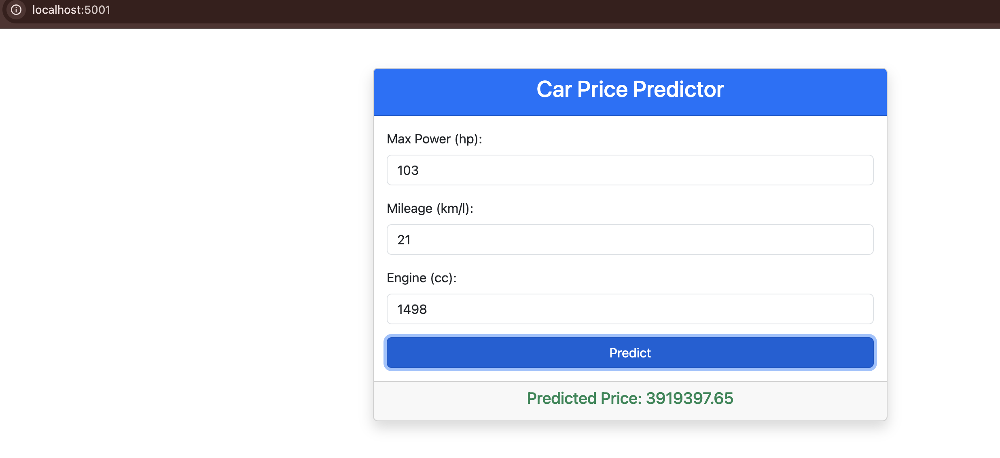

# Flask Random Forest Model Deployment

This project demonstrates how to deploy a Random Forest model for predicting car prices using Flask. It includes a Bootstrap-based frontend for user interaction and is containerized using Docker for easy deployment.

---

## Features

- **Random Forest Model**: Predict car prices based on features such as max power, mileage, and engine capacity.
- **Flask Backend**: RESTful API for handling predictions.
- **Bootstrap Frontend**: User-friendly interface for entering input data.
- **Dockerized Application**: Portable and easy-to-deploy containerized setup.

---

## Deployment Result

Below is a screenshot of the deployed application:



The above screenshot shows the application running successfully with a user-friendly interface for inputting car data and receiving predictions.

---

## Prerequisites

Before running the project, ensure you have the following installed:

- [Python 3.9+](https://www.python.org/downloads/)
- [Docker](https://www.docker.com/)
- [Flask](https://flask.palletsprojects.com/)
- [Bootstrap](https://getbootstrap.com/)

---

## How to Run Locally

### 1. Clone the Repository

```bash
git clone <repository-url>
cd project
